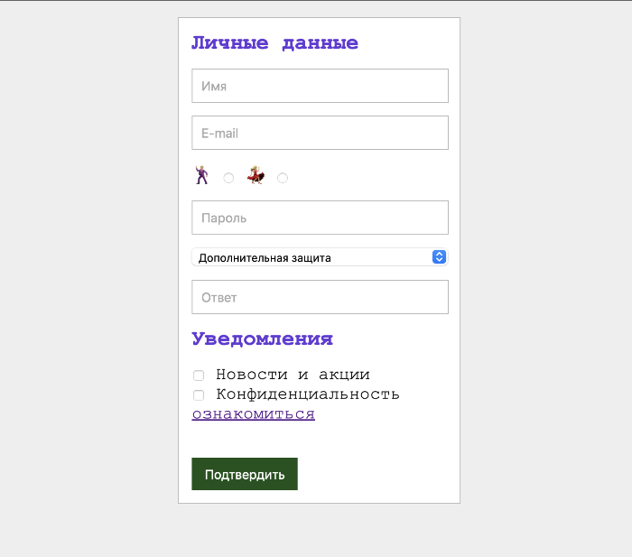

Самостоятельная работа
1. Создать форму регистрации;

2. Создать новую папку с именем sign-up;
3. Создать index.html и style.css, соединить их;
4. Цвет фона страницы #eee, 'Courier New', Courier, monospace, размер шрифта 20рх, цвет текста #0f0f0f;
5. Размер блока с формой 340рх с учетом padding, цвет фона белый, сплошная граница шириной 1рх, цвет #bababa, расположение по центру по горизонтали, сверху имеется внешний отступ;
6. Стили заголовков: цвет шрифта #643ad6, размер шрифта 25px;
7. Между элементами форм отступ снизу 15рх, граница 1рх сплошная #0f0f0f.
8. Цвет фона кнопки "Подтвердить" #1b521b;

> Примеры работы с разными типами форм [тут](https://github.com/iksergey/frontend-start/tree/main/part.003/ex5-forms), особое внимание уделить radio - кнопкам