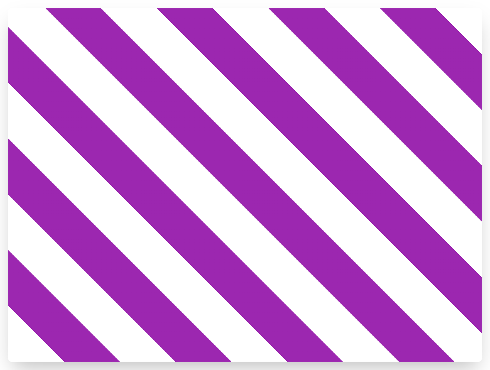

### Создайте повторяющийся паттерн следующего вида:


- Направление: 45 градусов
- Прозрачный цвет занимает первые 100 пикселей
- Фиолетовый цвет занимает следующие 100 пикселей
- Используйте цвета из переменных

цвета

```css
:root {
  --transparent: transparent;
  --purple: #9c27b0;
}

```