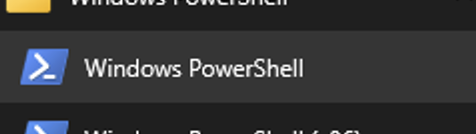
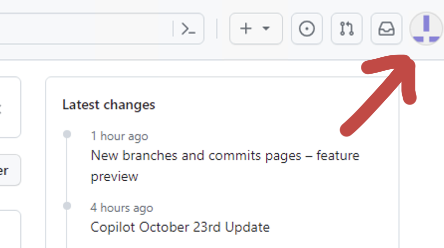
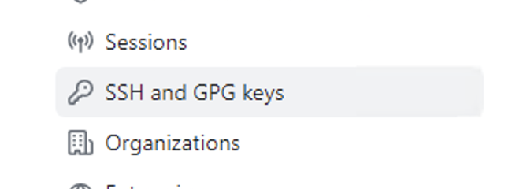
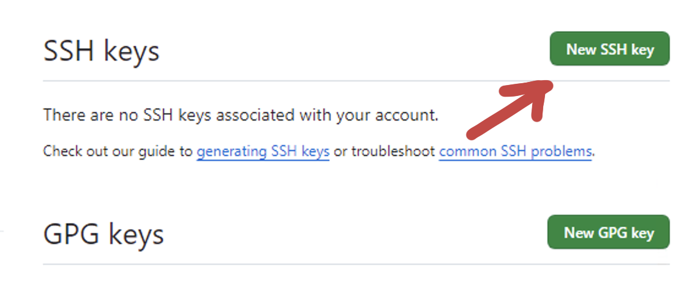
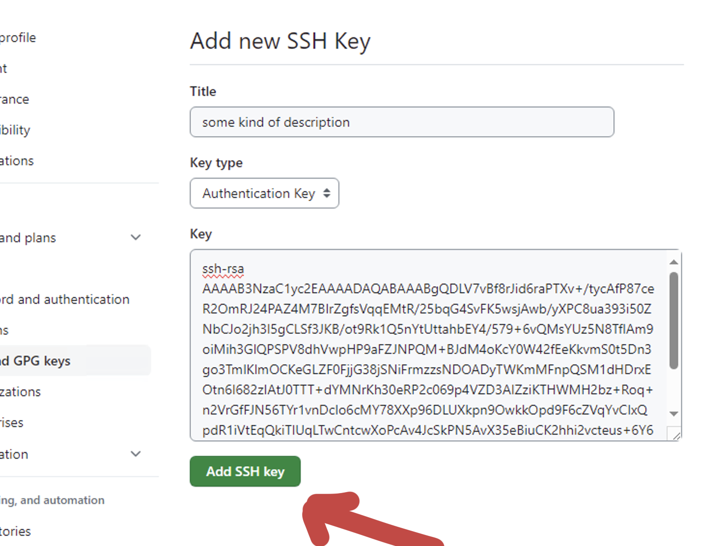
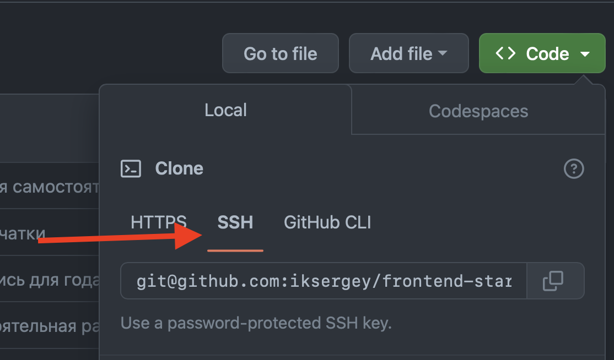

# Инструкция подключения к github при помощи SSH

## 1.1 Подготовка. Windows

Перейдите к папке `C:\Users\<Имя учётной записи>\.ssh` если она существует - удалите всё её содержимое (можно и саму папку)

1. Открыть Windows PowerShell



2. Прописать `git --version`
  - Если в ответ показана версия `git version 2.39.3` (или иная версия) - значит git установлен.
  - Если в ответ, что-то похожее:

```powershell
PS C:\Users\Администратор> git --version
git : Имя "git" не распознано как имя командлета, функции, файла сценария или выполняемой программы. Проверьте правильность написания имени, а также наличие и правильность пути, после чего повторите попытку.
строка:1 знак:1
+ git --version
+ ~~~
    + CategoryInfo          : ObjectNotFound: (git:String) [], CommandNotFoundException
    + FullyQualifiedErrorId : CommandNotFoundException

```

или такое

```powershell
PS C:\Users\Administrator> git --version
git : The term 'git' is not recognized as the name of a cmdlet, function, script file, or operable program. Check the s
pelling of the name, or if a path was included, verify that the path is correct and try again.
At line:1 char:1
+ git --version
+ ~~~
    + CategoryInfo          : ObjectNotFound: (git:String) [], CommandNotFoundException
    + FullyQualifiedErrorId : CommandNotFoundException

```

значит git не установлен.

Закрыть окно `Windows PowerShell`, перейти на сайт [Download for Windows](https://git-scm.com/download/win) скачать и установить Git.

После установки повторить шаг 2.

Вместе с git, как правило, устанавливается оболочка `Bash`.

3. В меню "пуск" нужно найти `Git Bash` и запустить.


4. Проверить, что `git` установлен
```bash
Administrator@vdswin2k22 MINGW64 ~
$ git --version
git version 2.42.0.windows.2
```

5. Прописать `ssh -T git@github.com`.
  - Ответ может выглядеть так:
```bash
Administrator@vdswin2k22 MINGW64 ~
$ ssh -T git@github.com
The authenticity of host 'github.com (140.82.121.3)' can't be established.
ED25519 key fingerprint is SHA256:+DiY3wvvV6TuJJhbpZisF/zLDA0zPMSvHdkr4UvCOqU.
This key is not known by any other names.
Are you sure you want to continue connecting (yes/no/[fingerprint])?

```
нужно прописать `yes`, ответ скорее всего будет выглядеть так:
```bash
Administrator@vdswin2k22 MINGW64 ~
$ ssh -T git@github.com
The authenticity of host 'github.com (140.82.121.3)' can't be established.
ED25519 key fingerprint is SHA256:+DiY3wvvV6TuJJhbpZisF/zLDA0zPMSvHdkr4UvCOqU.
This key is not known by any other names.
Are you sure you want to continue connecting (yes/no/[fingerprint])? yes
Warning: Permanently added 'github.com' (ED25519) to the list of known hosts.
git@github.com: Permission denied (publickey).
```
Это означает, что никакого ssh-ключа в системе не найдено.

### Генерация нового ssh-ключа

6. В окне `Git bash` нужно прописать `ssh-keygen`

В терминале будет несколько вопросов: нужно просто несколько раз нажать `Enter`

Примерный вид терминала после всех подтверждения

```bash
Administrator@vdswin2k22 MINGW64 ~
$ ssh-keygen
Generating public/private rsa key pair.
Enter file in which to save the key (/c/Users/Administrator/.ssh/id_rsa):
Enter passphrase (empty for no passphrase):
Enter same passphrase again:
Your identification has been saved in /c/Users/Administrator/.ssh/id_rsa
Your public key has been saved in /c/Users/Administrator/.ssh/id_rsa.pub
The key fingerprint is:
SHA256:ZdmCspJBFieF28K6G1EDeFaKbtIz7qSJko9WI+OSjvA Administrator@vdswin2k22
The key's randomart ./img/image is:
+---[RSA 3072]----+
| ...*+o          |
|..o=.o   . o     |
|.o..+o. . = .    |
|.. .++.o o .     |
|.o=.o.. S        |
|o+.* .           |
|ooB..            |
|OX..             |
|@oE.             |
+----[SHA256]-----+
```

7. Прописать в терминале `ssh -T git@github.com` в ответ должно быть что-то такое:

```bash
Administrator@vdswin2k22 MINGW64 ~
$ ssh -T git@github.com
git@github.com: Permission denied (publickey).
```
Это означает, что ключ сгенерирован, но пока что не прописан на github.

8. Нужно перейти к папке `C:\Users\<Имя учётной записи>\.ssh` и открыть файл при помощи блокнота. Скопировать всё содержимое

*Можно при помощи терминала: `cd C:\Users\<Имя учётной записи>\.ssh` и затем выполнить `vim id_rsa.pub` или `cat id_rsa.pub` или `notepad id_rsa.pub`*
Переходите к части "Установка SSH ключа на github.com"

## 1.2 Подготовка. *Nix
1. В `Terminal` | `Bash` прописать `cd ~/.ssh`. Если такой папки нет - перейти к шагу 3.
2. Выполнить команду `rm *` для удаления всего содержимого папки `.ssh` и при необходимости подтвердить действие:
```bash
bash-3.2$ cd ~/.ssh
bash-3.2$ .ssh > rm *
bash-3.2$: sure you want to delete all 4 files in /Users/i/.ssh [yn]? y
bash-3.2$:
```
3. Выполнить команду `ssh-keygen`, при необходимости несколько раз нажать клавишу Enter/Return
```bash
bash-3.2$ ssh-keygen
Generating public/private rsa key pair.
Enter file in which to save the key (/Users/i/.ssh/id_rsa):
Enter passphrase (empty for no passphrase):
Enter same passphrase again:
Your identification has been saved in /Users/i/.ssh/id_rsa
Your public key has been saved in /Users/i/.ssh/id_rsa.pub
The key fingerprint is:
SHA256:cuYCzycjsBBwhAzZNYR6JqdKESF433IdgJnHdjDKYxE i@ksergeyru.local
The key's randomart image is:
+---[RSA 3072]----+
|B*++E*+o         |
|*++.+++.o        |
|.o..=+ o .       |
|oo+.o.o .        |
|.*o .o. S        |
|.o o + =         |
|o . . * o        |
|.    . =         |
|                 |
+----[SHA256]-----+
bash-3.2$
```
4. Выполнить команду `cat ~/.ssh/id_rsa.pub` для открытия публичного ssh-ключа.
5. Скопировать полученное содержимое
```bash
bash-3.2$ cat ~/.ssh/id_rsa.pub
ssh-rsa AAAAB3NrdJ7lx30i0sZ3qfj4rdJ7lx30i0sZ3qfj4Z3qfj4X9
tYf7xqZ0GDVyfLrdJ7lx30i0sZ3qfj4VyfLrdJ7lx30i0sZ3qfj4X9tYzaC1
yc2EAAAX9tYf7xqZ0GDVyfLrdJ7lx30i0sZ3ADAQABDVyfLrdJ7lx30
i0sZ3qfj4/+3R7W50X9tYf7GDVyfLrdJ7lx30i0sZ3qfj4rdJ7lx30
i0sZ3qfj4Z3qfj4AAABgQCuVwDoQYk0uy/+3R7WGDVyGqfj4VyfL
rdJ7lx30i0sZ3qfj4X9tYf7xqZ0FZ6eL9ewiM2JIChFw5Dr73wywRfk= i@ksergey
```

# Установка SSH ключа на github.com

1. Перейти на сайт [github.com/](https://github.com/)
2. Войти в свой аккаунт `Sign in`
3. В верхней правой части страницы, кликнуть по значку своего профиля и перейти к настройкам
- 
- 

4. Слева в меню выбрать `SSH and GPG keys`

- 

5. Нажать `New SSH key`

- 

6. На открывшейся странице
 - добавить какое-то описание в поле Title
 - Key type оставить без изменения
 - в коле Key вставить текст, полученный на последнем шаге подготовки
 - нажать кнопку `Add SSH key`

- 

7. Вернуться к bash и прописать `ssh -T git@github.com` в ответ должно быть приветствие с указанием никнейма вашего аккаунта
```bash
Administrator@vdswin2k22 MINGW64 ~/.ssh
$ ssh -T git@github.com
Hi ksergey! You've successfully authenticated, but GitHub does not provide shell access.
```

возможно придётся ввести подтверждение

```bash
bash-3.2$ ssh -T git@github.com
The authenticity of host 'github.com (10.11.12.13)' can't be established.
ED25519 key fingerprint is SHA256:+DiY3wvvV6TuJJhbpZisF/zLDA0zPMSvHdkr4UvCOqU.
This key is not known by any other names.
Are you sure you want to continue connecting (yes/no/[fingerprint])? yes
Warning: Permanently added 'github.com' (ED25519) to the list of known hosts.
Hi ksergey! You've successfully authenticated, but GitHub does not provide shell access.
bash-3.2$ clear
```
# Готово

Теперь клонировать репозитории можно при помощи `git@github.com:ikser...`



Попробуйте

```bash
git clone git@github.com:iksergey/frontend-start.git
```
В случае правильной настройки ssh всё должно получиться

```bash
trash.1000 > git clone git@github.com:iksergey/frontend-start.git
Cloning into 'frontend-start'...
remote: Enumerating objects: 661, done.
remote: Counting objects: 100% (20/20), done.
remote: Compressing objects: 100% (19/19), done.
remote: Total 661 (delta 4), reused 13 (delta 1), pack-reused 641
Receiving objects: 100% (661/661), 56.33 MiB | 4.45 MiB/s, done.
Resolving deltas: 100% (226/226), done.
```