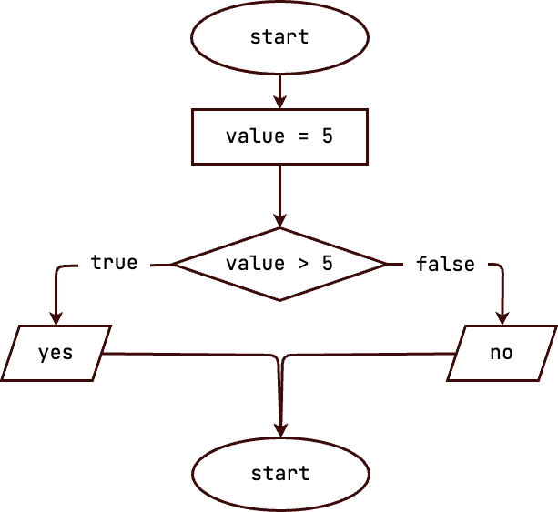
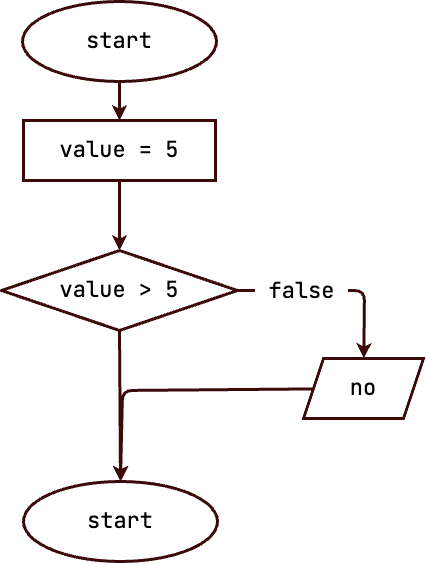
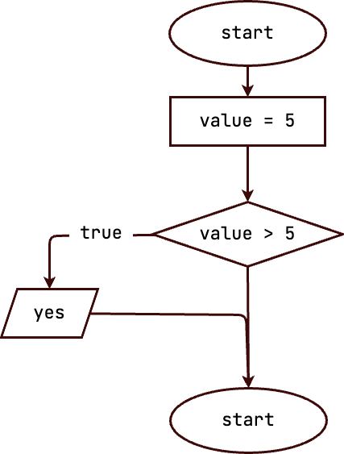
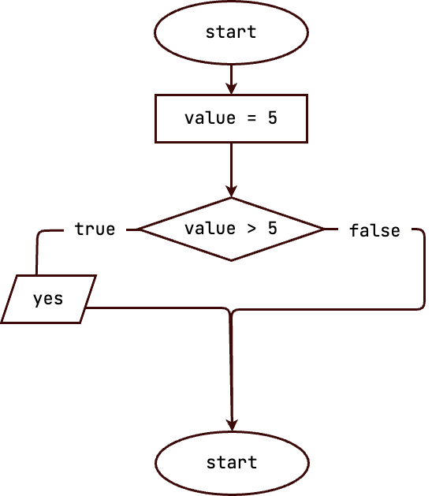

## Условные конструкции

Условные конструкции позволяют изменить поведение программы в зависимости от проверяемых условий. Благодаря им у нас появляется возможность писать сложные программы, ведущие себя по-разному в зависимости от ситуации.

### Вариант 1



```js
const value = 5;

if (value > 5) {
  console.log('yes');
} else {
  console.log('no');
}

```

### Вариант 2



```js
const value = 5;

if (value > 5) {

} else {
  console.log('no');
}
```

### Вариант 3



```js
const value = 5;

if (value > 5) {
  console.log('yes');
}
```

### Вариант 4



```js
const value = 5;

if (value > 5) {
  console.log('yes');
} else {

}
```