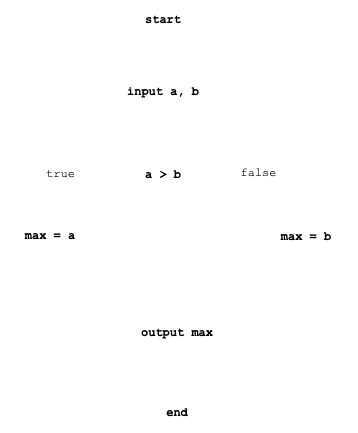
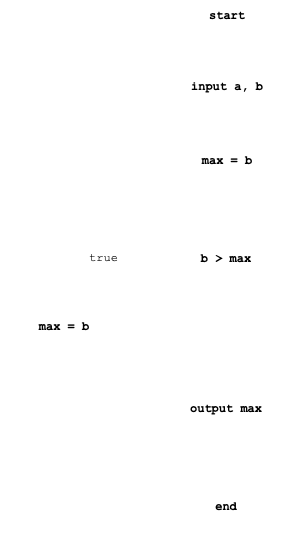
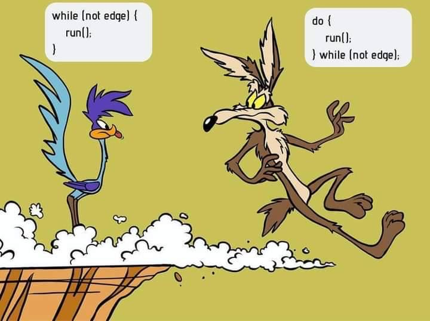
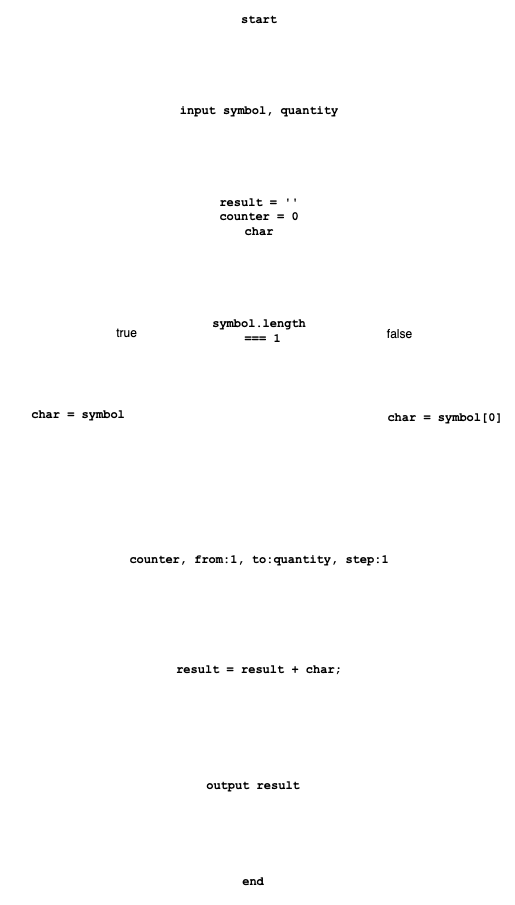

# Подготовка

Для ввода данных используется библиотека [readline-sync](https://www.npmjs.com/package/readline-sync)

## Создание нового проекта
- новый проект `npm init -y`
- в [package.json](./source-code/package.json) добавить `"type": "module",`
- в [package.json](./source-code/package.json) добавить `"start": "node index.js",`
- добавление библиотеки `npm i readline-sync`
- при необходимости выполнить `npm install`
- запустить `npm start`

# Условия
В языке JavaScript условие реализовано оператором if:

```js
if (<условие>) {
  // делать, если условие верно
}
else {
  // делать, если условие неверно
};
```
## Особенности:
- вторая часть (`else`) может отсутствовать (неполная форма);
- если в блоке один оператор, то можно убрать скобки { и }.

### Задача. Ввести два числа и вывести наибольшее из них.

Алгоритм решения:


### Пример программы, реализующей алгоритм:

[code](./source-code/if-else/ex01-if-else.js)

```js
const a = readInt('a: ');
const b = readInt('b: ');

let max;

if (a > b) {
  max = a;
} else {
  max = b;
}

console.log(`>> max(${a}, ${b}): ${max}`);
```

## Неполная форма условного оператора:


```js
const a = readInt('a: ');
const b = readInt('b: ');

let max = a;

if (b > max) {
  max = b;
}

console.log(`>> max(${a}, ${b}): ${max}`);
```
## Тернарная операция

Тернарный оператор (`? :`) представляет собой условный оператор и часто используется вместо определённых видов конструкций `if-then-else`. Общая форма этого оператора:

- `expression1 ? expression2 : expressionЗ;`
В случае сохранения результата вычисления
- `variable = expression1 ? expression2 : expressionЗ;`

*Если `expression1` — истинно, то берётся `expression2`, иначе берётся `expression3`.*

### Чётное или нечётное число.

```js
const maximumTwoNumbersTernaryOperator = (a, b) => {
  let max = (a > b) ? a : b;
  return max;
}
```

```js
const isEvenOrOdd = (value) => {
  let result = value % 2 === 0 ? 'чётное число' : 'нечётное число';
  return result;
}
```
## Оператор выбора

Оператор switch предназначен для разветвления процесса выполнения программы:

```js
const fullSwitch = (value) => {
  let result = '';

  switch (value) {
    case 1:
      result = 'case 1';
      break;
    case 2:
      result = 'case 2';
      break;
    default:
      result = 'default case';
      break;
  }

  return result;
};
```
### Пример использования switch. Месяц года
Функции передаётся число и возвращает какой это месяц.

```js

const getTimeOfYear = (month) => {
  let timeOfYear = '';
  switch (month) {
    case 1:
    case 2:
    case 12: timeOfYear = "Winter";
      break;
    case 3:
    case 4:
    case 5: timeOfYear = "Spring";
      break;
    case 6:
    case 7:
    case 8: timeOfYear = "Summer";
      break;
    case 9:
    case 10:
    case 11: timeOfYear = "Autumn";
      break;
    default:
      timeOfYear = "Nothing";
      break;
  }

  return timeOfYear;
}
```
## Циклы
Цикл — это многократное выполнение одинаковой последовательности действий.
В JavaScript доступны циклы:
- цикл while;
- цикл do-while;
- цикл for;

## Задача.
Собрать строку из заданного символа повторяющегося указанное количество раз

## Цикл while
Формат оператора:
```js
while (condition) {
  operator;
}
```


```js
const whileStringBuilder = (symbol, quantity) => {
  let result = '';
  let counter = 0;
  const char = symbol.length === 1 ? symbol : symbol[0];

  while (counter < quantity) {
    result = result + char;
    counter++;
  }

  return result;
}
```

## Цикл do-while
Формат оператора:
```js
do {
  operator;
} while (condition);

```


```js
const doWhileStringBuilder = (symbol, quantity) => {
  let result = '';
  let counter = 0;
  const char = symbol.length === 1 ? symbol : symbol[0];

  do {
    result = result + char;
    counter++;
  } while (counter < quantity);

  return result;
}
```

## while vs do-while

```js
while (not edge) {
  run();
}
```

```js
do {
  run();
} while (not edge);
```



<hr>

## Цикл for
Формат оператора:

```js
for (init; condition; change) {
  operator;
}
```



```js
const forStringBuilder = (symbol, quantity) => {
  let result = '';
  let counter = 0;
  const char = symbol.length === 1 ? symbol : symbol[0];

  for (let counter = 0; counter < quantity; counter++) {
    result = result + char;
  }

  return result;
}
```
### Замечания

- можно использовать сложные условия;
- если в теле цикла только один оператор, скобки { и } можно не писать;
- тело цикла do-while всегда выполняется хотя бы один раз.
