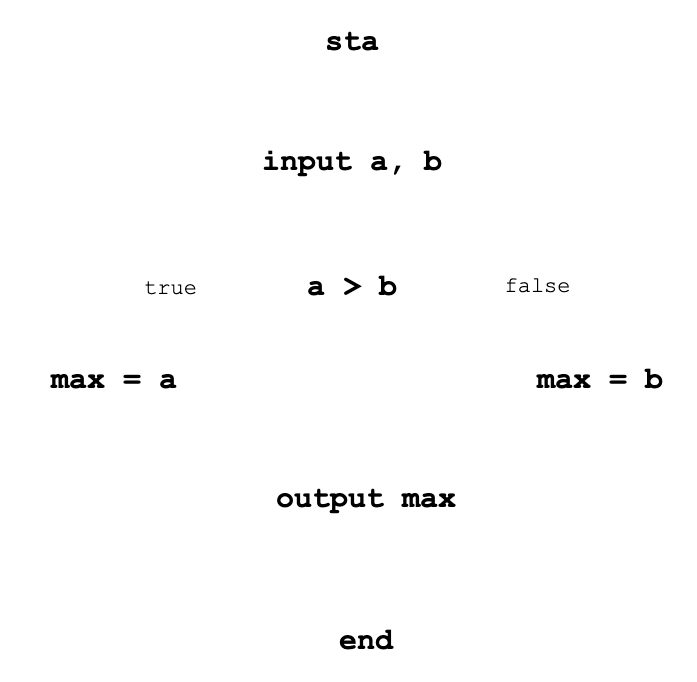

# Подготовка

Для ввода данных используется библиотека [readline-sync](https://www.npmjs.com/package/readline-sync)

## Создание нового проекта
- новый проект `npm init -y`
- в [package.json](./source-code/package.json) добавить `"type": "module",`
- в [package.json](./source-code/package.json) добавить `"start": "node index.js",`
- добавление библиотеки `npm i readline-sync`
- при необходимости выполнить `npm install`
- запустить `npm start`

# Условия
В языке JavaScript условие реализовано оператором if:

```js
if (<условие>) {
  // делать, если условие верно
}
else {
  // делать, если условие неверно
};
```
## Особенности:
- вторая часть (`else`) может отсутствовать (неполная форма);
- если в блоке один оператор, то можно убрать скобки { и }.

### Задача. Ввести два числа и вывести наибольшее из них.

Алгоритм решения:


### Пример программы, реализующей алгоритм:

[code](./source-code/if-else/ex01-if-else.js)

```js
const a = readInt('a: ');
const b = readInt('b: ');

let max;

if (a > b) {
  max = a;
} else {
  max = b;
}

console.log(`>> max(${a}, ${b}): ${max}`);
```